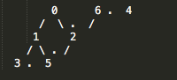
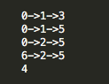

## Question

You are given a DAG which may be disjointed (this represents courses in a university that must be taken in a particular order, but may represent different streams).

Identify all node with 0 in-degree.
For each such node, generate all possible paths that originate from that node. Assume all arrows are pointing downwards.

**Input**

[]

**Output**

[]

## Solution

I have taken a ***adjacency list*** representation of a graph for solving the above question. The ***adjacency list*** is represented by the variable name `adjacencyList` in the code.

## How to run the code?

The file `input-handler.js` is responsible for interactively building the graph through command line interface. In order to quickly get started you can create a graph instance by providing a prepopulated adjacency matrix and call the relevant method:

```
let adjacencyList = [[1,2],[3,5],[5],[],[],[],[2]];
let graph = new Graph(adjacencyList);
graph.printZeroIndegreePaths();
```

`node input-handler.js` 
It is assumed that node is installed in the system.
